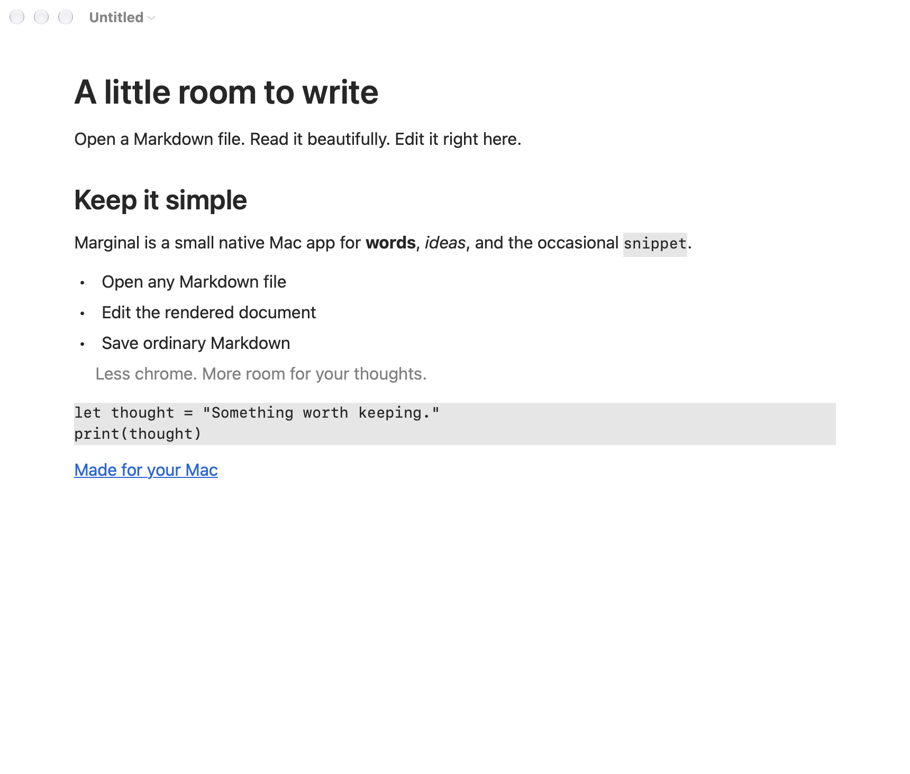
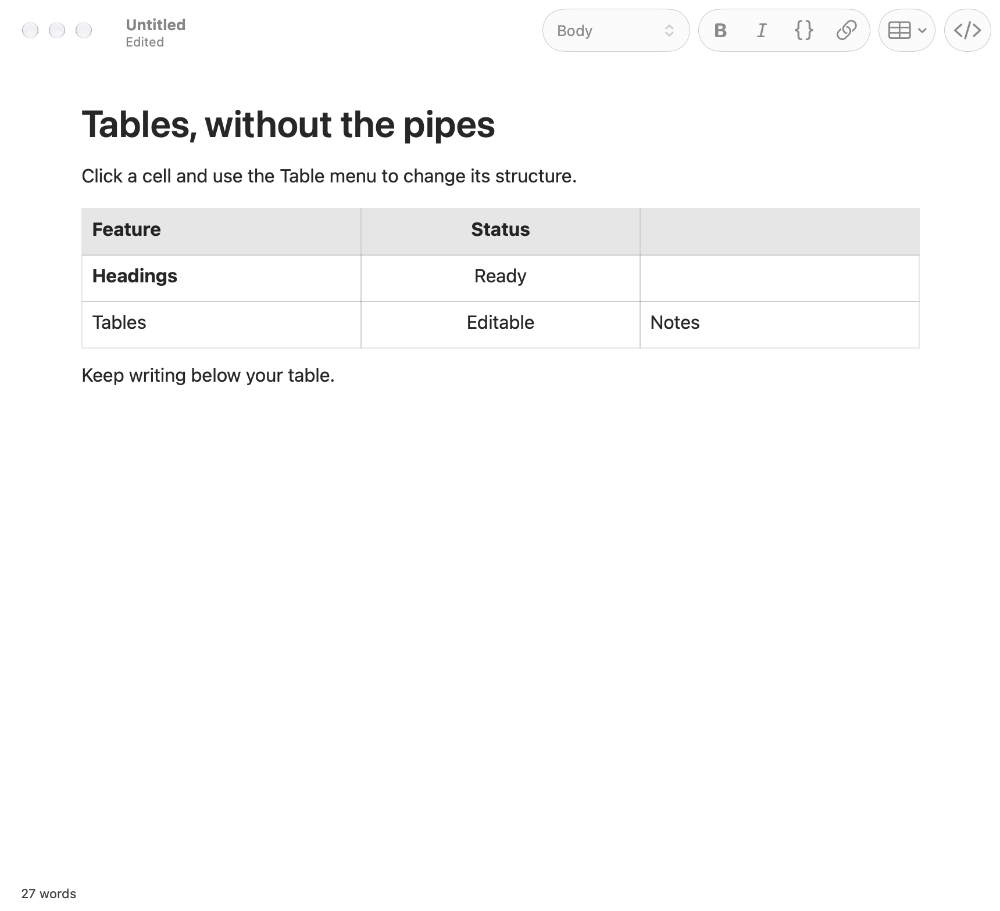

# Marginal

A tiny, native Markdown viewer and WYSIWYG editor for macOS. Open a file, edit the rendered document, and save it as ordinary Markdown.

**[Download Marginal](https://github.com/acousland/marginal/releases/latest)** · macOS 13 or later · Apple silicon



## Install

Download the ZIP from Releases, unzip it, and drag **Marginal.app** to Applications.

The latest release is signed with Aaron Cousland's Apple Developer ID, notarized by Apple, and includes a stapled notarization ticket. It uses the hardened runtime and passes macOS Gatekeeper assessment.

## Use

Open a `.md`, `.markdown`, `.mdown`, `.mkd`, or `.txt` file with **File → Open** (⌘O), or drop it onto the app in Finder. Click anywhere in the rendered text and type. The default window keeps the document in focus, with the formatting toolbar and word count hidden. Use the **Format** and **Table** menus or keyboard shortcuts to edit. **View → Show Formatting Toolbar** (⌥⌘T) and **View → Show Word Count** bring back the optional controls; your choices are remembered for new windows. **⌘S** saves; standard macOS autosave also saves existing documents in place.

| Action | Shortcut |
| --- | --- |
| New / Open / Save | ⌘N / ⌘O / ⌘S |
| Save As | ⇧⌘S |
| Bold / Italic / Link | ⌘B / ⌘I / ⌘K |
| Inline code | ⇧⌘C |
| Body / Heading 1–3 | ⌥⌘0 / ⌥⌘1–3 |
| Bullet list / Numbered list / Quote | ⌥⌘7 / ⌥⌘8 / ⌥⌘9 |
| Find | ⌘F |
| Markdown source / Rendered editor | ⇧⌘M |
| Show / Hide formatting toolbar | ⌥⌘T |
| Zoom in / out | ⌘+ (or ⌘=) / ⌘− |
| Actual size | ⌘0 |

## Zoom and word wrap

Use **View → Zoom In**, **Zoom Out**, or **Actual Size** to scale the document from 50% to 300%. Trackpad pinch gestures also zoom. Zoom changes the view, leaving Markdown, formatting, and document edits untouched.

**View → Word Wrap** is on by default. Turn it off to read long paragraphs and code as single lines with horizontal scrolling; explicit line breaks stay in place. Tables keep their normal cell layout. Zoom and wrap work in both the rendered editor and Markdown source, and your choices are remembered for new windows.

## Typing shortcuts

At the start of a body paragraph, type a marker followed by **Space**. The marker disappears and the paragraph changes style:

| Type, then Space | Style |
| --- | --- |
| `#` through `######` | Heading 1–6 |
| `-`, `*`, or `+` | Bullet list |
| `1.` or `1)` | Numbered list (other starting numbers work too) |
| `>` | Quote |

Type three backticks (optionally followed by a language such as `swift`) and press **Return** to start a code block. Type three backticks on their own line and press Return to leave it. Return after a heading starts body text; Return continues a list, and Return on an empty list item exits it. Undo restores the typed marker. Shortcuts apply while typing in the rendered editor; source and code content remain literal.

## Tables

Use **Table → Insert Table…** to create a table with a header and the number of body rows and columns you choose. The optional formatting toolbar also has a table button. Click a cell, then use the same menu to add or delete rows and columns, align a column, or delete the table. These changes preserve cell formatting and support undo/redo. The required header row and final column cannot be deleted individually.

**Tab** and **Shift-Tab** move between cells; Tab from the last cell adds a row. **Return** inserts a line break inside a cell. **Table → Paragraph After Table** moves you out of the table to keep writing. Use the Table controls to change structure; Backspace and Delete protect cell boundaries.



## Updates

Marginal uses [Sparkle](https://sparkle-project.org/) for the same in-app update flow as Mondrian. Choose **Marginal → Check for Updates…** to check immediately, read the release notes, and download and install a newer version. Marginal relaunches after installation; unsaved documents go through the usual save prompts.

**Automatically Check for Updates** is enabled by default and checks about once a day. **Download and Install Updates Automatically** is optional and available while automatic checks are enabled. Both preferences are in the Marginal menu. An existing choice to disable automatic checks carries over.

Updates come from the public [release feed](https://raw.githubusercontent.com/acousland/marginal/main/appcast.xml). Sparkle verifies each archive against Marginal’s Ed25519 signing key before installing it. Releases are also Developer ID signed and notarized. Background connection failures stay quiet; manual checks show errors or an up-to-date result.

Update checks contact GitHub over HTTPS. Document contents and file paths remain local. Install this version once to give older Marginal copies the new in-app updater.

## What it handles

- Headings, bold, italic, strikethrough, links, inline code, and fenced code blocks.
- Bullet and numbered lists, nested lists, task-list display, quotes, and horizontal rules.
- Native tables with editable cell text and preserved column alignment.
- Local images, resolved relative to the Markdown file.
- Native undo/redo, find, document windows, recent files, and light/dark appearance.

Untouched files save byte for byte. Editing produces equivalent Markdown with normalized spacing, escaping, and inline links. Files must be UTF-8.

Keep advanced syntax edits in the source view: task checkboxes, complex list items with multiple paragraphs, and metadata/HTML. YAML front matter, HTML, and unsupported blocks are displayed as preserved source. Remote images use a placeholder; the document's image URL is retained. Moving a document with relative image paths keeps those paths unchanged.

## Build

All builds, tests, packaging, and release preparation run locally. GitHub hosts source, release downloads, and the update feed; GitHub Actions is disabled for this repository.

Install Xcode and its command-line tools, then:

```sh
swift test
python3 scripts/test-appcast.py
scripts/build.sh
open dist/Marginal.app
```

The build script creates an Apple silicon (`arm64`) app with an ad-hoc development signature and an embedded Sparkle framework. Set `MARGINAL_FEED_URL=none` for a trial build without update checks. Open `Package.swift` in Xcode to work on the app.

The bundle has a self-test for file-type registration and opening, editing, saving, and reopening a Markdown file. Its display test opens a temporary document window and exercises zoom, magnification, scrolling, word wrap, source mode, and resizing through the real AppKit event loop. You can also check the live update endpoint without displaying UI:

```sh
dist/Marginal.app/Contents/MacOS/Marginal --smoke-test
dist/Marginal.app/Contents/MacOS/Marginal --display-smoke-test
dist/Marginal.app/Contents/MacOS/Marginal --check-updates
```

## Signed releases

Update the default version in `scripts/build.sh`, `scripts/release.sh`, and `Resources/Info.plist`, and write the matching `RELEASE_NOTES.md`. Commit and push the source, then publish from this Mac:

```sh
NOTARY_PROFILE=renoir-notary scripts/publish-release.sh 1.2.4
```

The script runs the tests, builds and signs the app and Sparkle helpers with a Developer ID Application certificate, notarizes and staples the app, verifies Gatekeeper acceptance, and signs the final ZIP using the `marginal` Sparkle account in the login Keychain. It publishes the tag, archive, and checksum to GitHub, verifies the download is available, then commits and publishes the updated `appcast.xml`. The feed never offers an archive before it is uploaded. Versions must increase; both bundle version fields use the release version.

On this Mac the saved notarization profile is `renoir-notary`. On another Mac, save credentials interactively using `xcrun notarytool store-credentials` and set `NOTARY_PROFILE` accordingly. Set `SIGNING_IDENTITY` to choose a particular Developer ID Application certificate.

Marginal’s public update key is in `Resources/sparkle-public-key`; its private key stays in Keychain. For a new project, create a key using Sparkle’s `generate_keys --account <account>`. To release this app from another Mac, securely transfer the existing key using Sparkle’s key export/import tools. Keep credentials and private keys out of this repository.

To prepare signed artifacts without publishing:

```sh
SIGNING_IDENTITY='Developer ID Application: Your Name (TEAMID)' \
NOTARY_PROFILE='your-keychain-profile' \
VERSION=1.2.4 scripts/release.sh
```

## Implementation

Swift and AppKit, with native `NSTextView` editing and [Swift Markdown](https://github.com/swiftlang/swift-markdown) for CommonMark/GFM parsing. Markdown is parsed when opening a document or switching from source to rendered mode. Typing uses the native text system; Markdown serialization happens on save or when switching to source. Editing stays local and remote images are not fetched. Update checking, archive verification, and installation use Sparkle’s standard native updater.

[MIT license](LICENSE). Dependency licenses are included in the app bundle.
